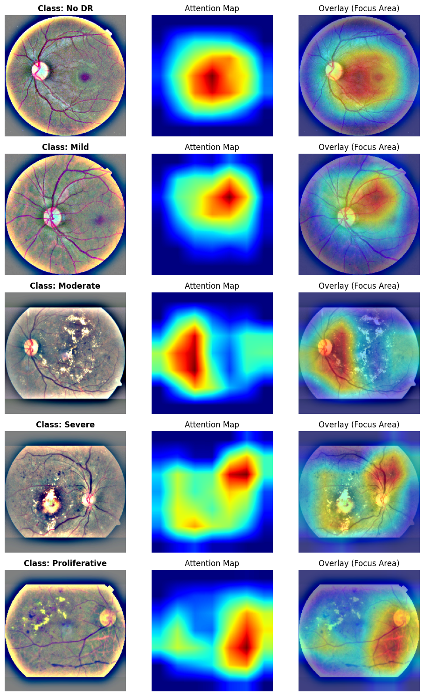
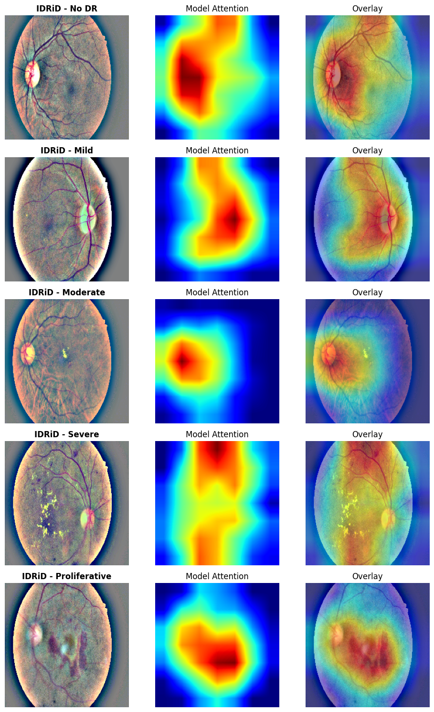

<h1 align="center">
👁️ Reti-TransNet: Overcoming Static Fusion Limitations in Diabetic Retinopathy Grading via Adaptive Gated Feature Alignment and Robust Cross-Dataset Generalization
</h1>

<p align="center">
  <!-- 1. License -->
  <a href="https://opensource.org/licenses/MIT">
    
  </a>
  <!-- 2. Python Version -->
  <a href="https://www.python.org/">
    
  </a>
  <!-- 3. Framework -->
  <a href="https://pytorch.org/">
    
  </a>
  <!-- 4. Dataset Link -->
  <a href="https://www.kaggle.com/c/aptos2019-blindness-detection">
    
  </a>
  <!-- 5. Paper Status -->
  
</p>

---

## 🚀 Quick Start on Google Colab (One-Click Reproduction)

You can reproduce the entire study (Setup → Training → Evaluation) directly in your browser without any manual file handling.

[](https://colab.research.google.com/drive/18i2czNSQqpsEAfTJjQWZMmcOJWqAcYbE)

### 🛠️ Instructions for Reviewers

1.  **Click the Badge:** Click the **"Open in Colab"** button above to launch the pre-configured notebook.
2.  **Run the Script:** Execute the code cell. The script will automatically fetch the repository and dependencies.
3.  **Upload Key:** When prompted by the script, upload your **`kaggle.json`** API key to download the datasets (APTOS 2019 & IDRiD).
4.  **View Results:** The system will automatically train the model and display the final metrics (Kappa, AUC) and Grad-CAM++ figures.

---

## 📌 Abstract

Diabetic Retinopathy (DR) requires precise detection of both minute local lesions and global structural distortions. **Reti-TransNet** is a novel hybrid framework that synergizes the local feature extraction capability of **EfficientNet-B0** with the global context modeling power of **Swin Transformer**. Unlike trivial concatenation strategies, we introduce a learnable **"Adaptive Gated Fusion"** mechanism to dynamically weight the importance of local versus global features based on image complexity.

### 🔑 Key Achievements
*   🏆 **State-of-the-Art Reliability:** Achieved a **Quadratic Weighted Kappa of 0.905** on the internal APTOS 2019 dataset.
*   🌍 **Robust Generalization:** Demonstrated strong **cross-dataset performance** on the external **IDRiD** dataset (**AUC 0.963** for screening healthy patients).
*   🔍 **Explainability:** Integrated **Grad-CAM++** ensures clinical transparency by localizing pathological biomarkers.
*   ⚡ **Efficiency:** Aligned with Green AI principles, training converges within **25 epochs (~30 minutes)** on a single NVIDIA Tesla T4 GPU.

---

## 🏗️ Architecture

The proposed architecture consists of two parallel branches (CNN & Transformer) fused by a novel **Adaptive Gated Fusion Mechanism**.

<p align="center">
  
  <br><em>Fig 1: Overall workflow of the Reti-TransNet architecture.</em>
</p>

---

## 📊 Experimental Results

Our model demonstrates superior reliability (Kappa) and screening safety compared to recent state-of-the-art methods.

### 1. Internal Validation (APTOS 2019)
Reti-TransNet shows exceptional performance in identifying healthy patients (Screening) and high consistency with expert graders.

| Metric | Result (95% CI) |
| :--- | :--- |
| **Kappa ($\kappa$)** | **0.905** (0.88 - 0.93) |
| **Accuracy** | **84.31%** |
| **AUC (No DR)** | **0.998** |

<p align="center">
  
  <br><em>Fig 2: Internal ROC Curves showing high discriminative ability.</em>
</p>

### 2. External Validation (IDRiD - Generalization)
Despite domain shift (different camera specifications and population), the model maintains high screening reliability without fine-tuning.

| Metric | Result |
| :--- | :--- |
| **Kappa ($\kappa$)** | **0.77** |
| **Accuracy** | **59.12%** |
| **AUC (No DR)** | **0.963** |

<p align="center">
  
  <br><em>Fig 3: External ROC Curves demonstrating robust generalization.</em>
</p>

---

## 🔍 Explainability (Grad-CAM++)

We utilize **Grad-CAM++** to ensure the model focuses on clinically relevant features rather than artifacts. The visualizations below confirm the model's reliability in distinguishing healthy eyes from early-stage disease.

### 1. Internal Validation (APTOS 2019)
The model demonstrates precise localization of early pathological signs.
*   **Class: No DR:** The attention map is diffusely distributed across the retina, confirming the absence of focal lesions.
*   **Class: Mild:** The model accurately highlights subtle microaneurysms near the macula, which are critical for early detection.

<p align="center">
  
  <br><em>Fig 4: Qualitative analysis on APTOS 2019 dataset showing correct attention for No DR and Mild stages.</em>
</p>

### 2. External Generalization (IDRiD)
Despite the domain shift, Reti-TransNet maintains semantic consistency on the external dataset.
*   **IDRiD - No DR:** Similar to the internal set, the attention remains diffuse, validating the model's robust screening capability (AUC 0.963).
*   **IDRiD - Mild:** The model successfully identifies early-stage biomarkers even in images with different lighting conditions.

<p align="center">
  
  <br><em>Fig 5: Cross-dataset robustness on IDRiD. The model correctly processes external data without fine-tuning.</em>
</p>

---

## Project Structure

```
The repository is organized to ensure **modularity, clarity, and reproducibility**:

Reti-TransNet/
│
├── src/                     # Core implementation modules
│   ├── model.py             # Reti-TransNet architecture & Adaptive Gated Fusion
│   ├── dataset.py           # Custom dataset loaders with robust indexing
│   └── utils.py             # Utilities (Ben Graham preprocessing, seeding)
│
├── weights/                 # Saved trained model checkpoints (if available)
├── images/                  # Figures used in README
│
├── train.py                 # Training pipeline (two-stage transfer learning)
├── evaluate.py              # Evaluation (TTA, threshold optimization, Grad-CAM++)
├── download_data.py         # Automated dataset download (Kaggle mirrors)
│
├── requirements.txt         # Python dependencies
└── README.md                # Project documentation
```

## Citation

```bibtex
@article{RetiTransNet2026,
  title={Reti-TransNet: An Adaptive Gated Hybrid CNN-Transformer Framework for Diabetic Retinopathy Grading},
  author={Anonymous Authors},
  journal={Submitted to Computers in Biology and Medicine},
  year={2026}
}
```

## License

This project is licensed under the MIT License - see the [LICENSE](LICENSE) file for details.


