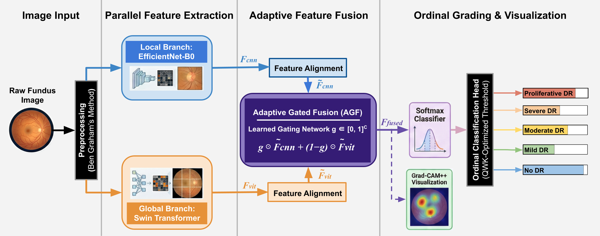
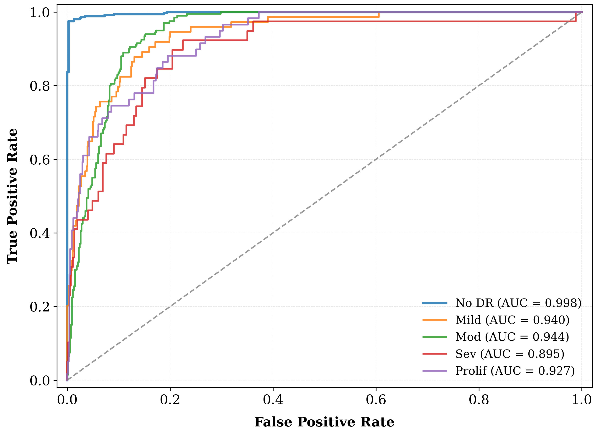
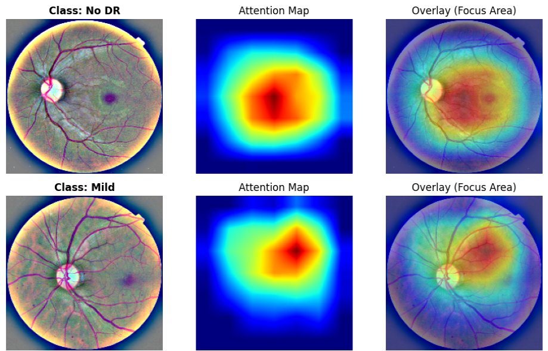
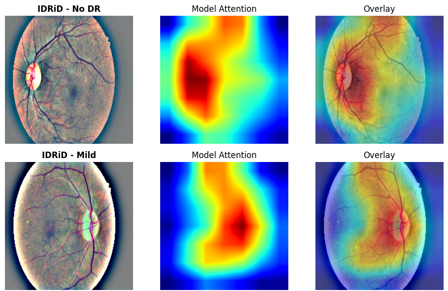

<h1 align="center">
👁️ Reti-TransNet: Overcoming Static Fusion Limitations in Diabetic Retinopathy Grading via Adaptive Gated Feature Alignment and Robust Cross-Dataset Generalization
</h1>

<p align="center">
  <!-- 1. License -->
  <a href="https://opensource.org/licenses/MIT">
    
  </a>
  <!-- 2. Python Version -->
  <a href="https://www.python.org/">
    
  </a>
  <!-- 3. Framework -->
  <a href="https://pytorch.org/">
    
  </a>
  <!-- 4. Dataset Link (APTOS) -->
  <a href="https://www.kaggle.com/c/aptos2019-blindness-detection">
    
  </a>
  <!-- 5. Dataset Link (IDRiD) -->
  <a href="https://ieee-dataport.org/open-access/indian-diabetic-retinopathy-image-dataset-idrid">
    
  </a>
  <!-- 6. Paper Status -->
  
</p>

---
## ✨ Project Overview (For JESTECH Reviewers)

This repository provides the source code and reproducibility pipeline for **Reti-TransNet**, a novel hybrid deep learning framework proposed for Diabetic Retinopathy (DR) grading. Our work addresses the critical limitations of **static feature fusion** in conventional Convolutional Neural Networks (CNNs) and Vision Transformers (ViTs). Through an **Adaptive Gated Fusion (AGF)** mechanism, Reti-TransNet dynamically aligns local lesion features with global structural patterns, overcoming a fundamental engineering bottleneck in existing methodologies.

The primary objective of this repository is to enable transparent and effortless reproduction of all experimental results presented in our submitted manuscript, including internal validation on APTOS 2019, rigorous external generalization on IDRiD, ablation studies, and Grad-CAM++ visualizations.

---
## 🚀 Quick Start on Google Colab (One-Click Reproduction)

You can reproduce the entire study (Setup → Training → Evaluation) directly in your browser without any manual file handling.

[](https://colab.research.google.com/drive/1WmXA3ZfXJsQ0L7eGxNUDQ8kk5ApTLmZf)

### 🛠️ Instructions for Reviewers

1.  **Click the Badge:** Click the **"Open in Colab"** button above to launch the pre-configured notebook.
2.  **Run the Script:** Execute the code cell. The script will automatically fetch the repository and dependencies.
3.  **Upload Key:** When prompted by the script, upload your **`kaggle.json`** API key to download the datasets (APTOS 2019 & IDRiD).
4.  **View Results:** The system will automatically train the model and display the final metrics (Kappa, AUC) and Grad-CAM++ figures.
*Note: The Colab session is expected to complete the full training and evaluation process in approximately 30 minutes on a single NVIDIA Tesla T4 GPU. This runtime aligns with the efficiency claims stated in the manuscript.*
---

## 📌 Manuscript Abstract

Accurate screening of Diabetic Retinopathy (DR) requires the identification of both subtle local lesions and global structural alterations. To address the limitations of standard CNNs and static fusion strategies, we propose **Reti-TransNet**, a hybrid deep learning framework that integrates **EfficientNet-B0** and **Swin Transformer** via a novel **Adaptive Gated Fusion** mechanism. This mechanism enables dynamic weighting of local and global features according to image complexity. Evaluated on **APTOS 2019**, the model achieved a **Kappa of 0.905**. Importantly, **rigorous external validation** on the unseen **IDRiD** dataset confirmed robust generalization (**AUC 0.963** for screening healthy patients), bridging the gap between deep learning performance and clinical reliability.

---

## 🔑 Key Achievements (Linked to Codebase)
*   🏆 **State-of-the-Art Reliability:** Achieved a **Quadratic Weighted Kappa of 0.905** on the internal APTOS 2019 dataset. 
*   🌍 **Robust Generalization:** Demonstrated strong **cross-dataset performance** on the external **IDRiD** dataset (**AUC 0.963** for screening healthy patients). 
*   🔍 **Explainability:** Integrated **Grad-CAM++** ensures clinical transparency by localizing pathological biomarkers. 
*   ⚡ **Efficiency:** Aligned with Green AI principles, training converges within **25 epochs (~30 minutes)** on a single NVIDIA Tesla T4 GPU. (See: `train.py` and Colab outputs)

---

## 🏗️ Architecture

The proposed architecture consists of two parallel branches (CNN & Transformer) fused by a novel **Adaptive Gated Fusion Mechanism**. This mechanism is meticulously implemented within the `src/model.py` file.

<p align="center">
  
  <br><em>Fig 1: Overall workflow of the Reti-TransNet architecture.</em>
</p>

---

## 📊 Experimental Results and Reproducibility

Our model demonstrates superior reliability (Kappa) and screening safety compared to recent state-of-the-art methods. The following metrics and visualizations can be reproduced by running the `evaluate.py` script.

### 1. Internal Validation (APTOS 2019)
Reti-TransNet shows exceptional performance in identifying healthy patients (Screening) and high consistency with expert graders.

| Metric | Result (95% CI) |
| :--- | :--- |
| **Kappa ($\kappa$)** | **0.905** (0.88 - 0.93) |
| **Accuracy** | **84.31%** |
| **AUC (No DR)** | **0.998** |

<p align="center">
  
  <br><em>Fig 2: Internal ROC Curves showing high discriminative ability.</em>
</p>

### 2. External Validation (IDRiD - Generalization)
Despite domain shift (different camera specifications and population), the model maintains high screening reliability without fine-tuning.

| Metric | Result |
| :--- | :--- |
| **Kappa ($\kappa$)** | **0.772** |
| **Accuracy** | **59.1%** |
| **AUC (No DR)** | **0.963** |

<p align="center">
  
  <br><em>Fig 3: External ROC Curves demonstrating robust generalization.</em>
</p>

---

## 🔍 Explainability (Grad-CAM++) Visualizations

We utilize **Grad-CAM++** to ensure the model focuses on clinically relevant features rather than artifacts. The visualizations below confirm the model's reliability in distinguishing healthy eyes from early-stage disease. These visualizations are generated by running the `evaluate.py` script and saved to the `images/gradcam_visuals/` directory.

### 1. Internal Validation (APTOS 2019)
The model demonstrates precise localization of early pathological signs.
*   **Class: No DR:** The attention map is diffusely distributed across the retina, confirming the absence of focal lesions.
*   **Class: Mild:** The model accurately highlights subtle microaneurysms near the macula, which are critical for early detection.

<p align="center">
  
  <br><em>Fig 4: Qualitative analysis on APTOS 2019 dataset showing correct attention for No DR and Mild stages.</em>
</p>

### 2. External Generalization (IDRiD)
Despite the domain shift, Reti-TransNet maintains semantic consistency on the external dataset.
*   **IDRiD - No DR:** Similar to the internal set, the attention remains diffuse, validating the model's robust screening capability (AUC 0.963).
*   **IDRiD - Mild:** The model successfully identifies early-stage biomarkers even in images with different lighting conditions.

<p align="center">
  
  <br><em>Fig 5: Cross-dataset robustness on IDRiD. The model correctly processes external data without fine-tuning.</em>
</p>

---

## 📂 Project Structure

```
The repository is organized to ensure **modularity, clarity, and reproducibility**:

Reti-TransNet/
│
├── src/ # Core implementation modules
│ ├── model.py # Reti-TransNet architecture & Adaptive Gated Fusion
│ ├── dataset.py # Custom dataset loaders with robust indexing
│ └── utils.py # Utilities (Ben Graham preprocessing, seeding)
│
├── images/ # Figures used in README
│
├── train.py # Training pipeline (two-stage transfer learning)
├── evaluate.py # Evaluation (TTA, threshold optimization, Grad-CAM++)
├── download_data.py # Automated dataset download (Kaggle mirrors)
│
├── requirements.txt # Python dependencies
└── README.md               
```
## ⚠️ Ethical Considerations & Disclaimer

This project is intended **strictly for research and educational purposes**.
The proposed Reti-TransNet framework is **not designed, validated, or approved for clinical diagnosis or direct medical decision-making**.

All experiments were conducted using **publicly available and de-identified datasets** (APTOS 2019 and IDRiD). No private patient data were collected or processed as part of this work.

While the model demonstrates strong cross-dataset generalization and explainability, **its outputs should not be interpreted as clinically accurate or authoritative**. Any deployment in real-world clinical settings would require **extensive validation, regulatory approval, and expert supervision**.

The authors disclaim any responsibility for misuse of this software in medical or clinical environments beyond its intended research scope.

---

## 📜 Citation

```bibtex
@article{RetiTransNet2026,
  title={Reti-TransNet: An Adaptive Gated Hybrid Framework for Diabetic Retinopathy Grading},
  author={Anonymous Authors},
  journal={Submitted to Engineering Science and Technology, an International Journal (JESTECH)}, 
  year={2026}
}
```

## 📄 License

This project is licensed under the MIT License - see the [LICENSE](LICENSE) file for details.

## 🤝 Acknowledgements
<h4>APTOS 2019 & IDRiD:</h4> Publicly available datasets that enabled this research.
<h4>Open-source Libraries:</h4> PyTorch, NumPy, Scikit-learn, Matplotlib, and other tools supporting model development and evaluation.

