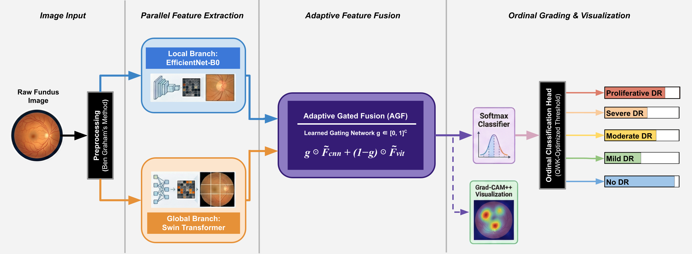
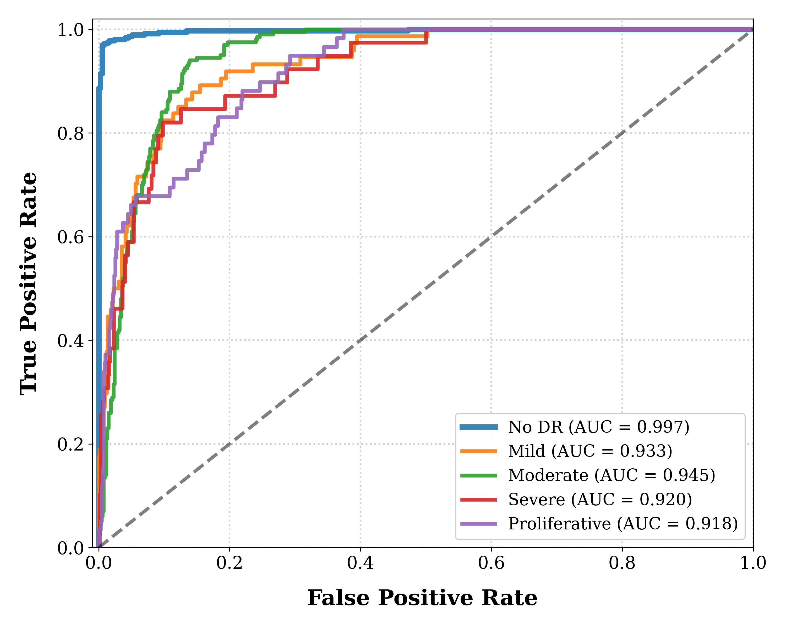
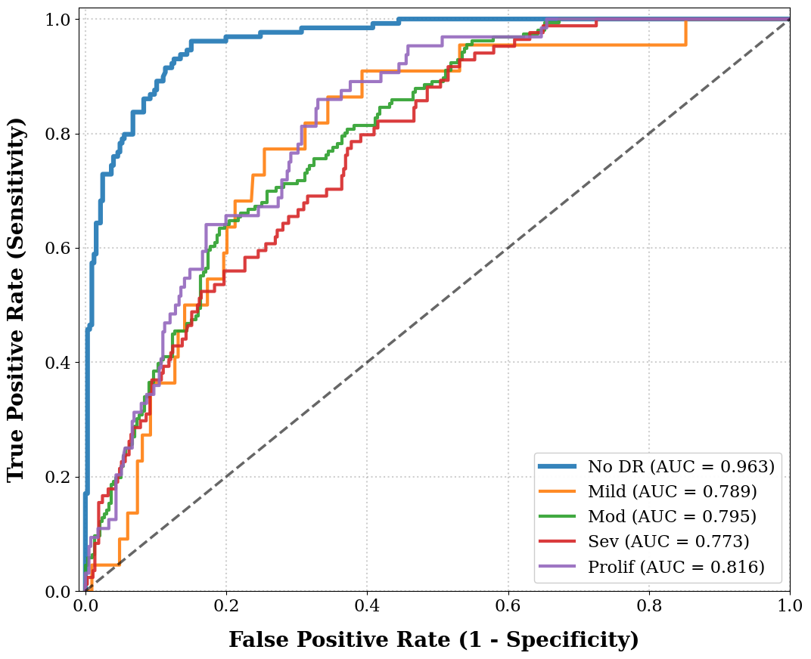

<h1 align="center">
👁️ Reti-TransNet: An Adaptive Gated Hybrid CNN-Transformer Framework for Diabetic Retinopathy Grading
</h1>


<p align="center">
  <a href="https://opensource.org/licenses/MIT">
    
  </a>
  <a href="https://www.python.org/">
    
  </a>
  <a href="https://pytorch.org/">
    
  </a>
  <a href="https://www.kaggle.com/c/aptos2019-blindness-detection">
    
  </a>
  <a href="https://www.kaggle.com/c/aptos2019-blindness-detection">
    
  </a>
  </a>
  
  
  
  <a href="#">
</p>

---

## 📌 Abstract

Diabetic Retinopathy (DR) requires precise detection of both minute local lesions and global structural distortions. **Reti-TransNet** is a novel hybrid framework that synergizes the local feature extraction capability of **EfficientNet-B0** with the global context modeling power of **Swin Transformer**. Unlike trivial concatenation strategies, we introduce a learnable **"Adaptive Gated Fusion"** mechanism to dynamically weight the importance of local versus global features based on image complexity.

### 🔑 Key Achievements
*   🏆 **State-of-the-Art Reliability:** Achieved a **Quadratic Weighted Kappa of 0.90** on the internal APTOS 2019 dataset.
*   🌍 **Robust Generalization:** Demonstrated strong zero-shot performance on the external **IDRiD** dataset (**AUC 0.958** for screening healthy patients).
*   🔍 **Explainability:** Integrated **Grad-CAM++** ensures clinical transparency by localizing pathological biomarkers.
*   ⚡ **Efficiency:** Trained in just **25 epochs** on a single NVIDIA Tesla T4 GPU, highlighting computational efficiency.

---

## 🏗️ Architecture

The proposed architecture consists of two parallel branches (CNN & Transformer) fused by a novel **Adaptive Gated Fusion Mechanism**.

<p align="center">
  
  <br><em>Fig 1: Overall workflow of the Reti-TransNet architecture.</em>
</p>

---

## 📊 Experimental Results

Our model demonstrates superior reliability (Kappa) and screening safety compared to recent state-of-the-art methods.

### 1. Internal Validation (APTOS 2019)
Reti-TransNet shows exceptional performance in identifying healthy patients (Screening) and high consistency with expert graders.

| Metric | Result (95% CI) |
| :--- | :--- |
| **Quadratic Kappa ($\kappa$)** | **0.90** (0.88 - 0.92) |
| **Accuracy** | **84.31%** |
| **No DR Recall** | **98%** |
| **AUC (No DR)** | **0.997** |

<p align="center">
  
  <br><em>Internal ROC Curves</em>
</p>

### 2. External Validation (IDRiD - Zero-Shot)
Despite domain shift (different camera specifications), the model maintains high screening reliability.

| Metric | Result |
| :--- | :--- |
| **AUC (No DR)** | **0.958** |
| **Kappa ($\kappa$)** | **0.77** |

<p align="center">
  
  <br><em>External ROC Curves (Zero-Shot)</em>
</p>

---

## 🚀 Quick Start on Google Colab (For Reviewers)

You can reproduce our results directly on Google Colab without installing anything on your local machine.

### Prerequisites
1.  **Google Account:** To access Colab.
2.  **Kaggle API Key (`kaggle.json`):** Required to download datasets automatically. [Get it here](https://www.kaggle.com/account).

### Step-by-Step Instructions

Open a new Colab Notebook:**
   *   Go to [Google Colab](https://colab.research.google.com/).
   *   Click **New Notebook**.
   *   **Important:** Go to `Runtime` > `Change runtime type` and select **T4 GPU**.

### 2. Clone Repository & Install Dependencies:**
Copy and run the following code in the first cell:


### 3. Upload API Key & Download Data
Run the following code in the second cell. It will verify your API key and execute the automated download script for APTOS and IDRiD datasets.

```python
# Clone the official repository and install dependencies
!git clone https://github.com/diclebilgisayar/Reti-TransNet.git
%cd Reti-TransNet
!pip install -r requirements.txt


from google.colab import files
import os

# Verify and upload Kaggle API credentials
# The kaggle.json file can be obtained from:
# Kaggle → Account → API → Create New API Token
if not os.path.exists('kaggle.json'):
    print("Please upload your kaggle.json file to proceed:")
    files.upload()

# Automatically download and prepare the APTOS and IDRiD datasets
!python download_data.py


# Train the proposed Reti-TransNet model
!python train.py


# Evaluate the trained model using standard medical imaging metrics
!python evaluate.py
