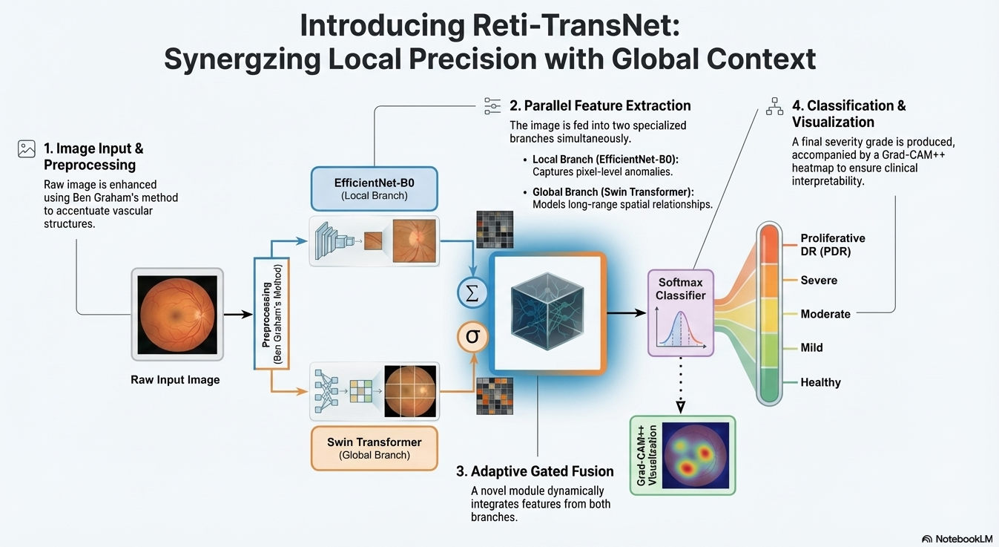

# 👁️ Reti-TransNet: An Adaptive Gated Hybrid CNN-Transformer Framework for Diabetic Retinopathy Grading

 

This repository contains the official PyTorch implementation of the paper:
"Reti-TransNet: An Adaptive Gated Hybrid CNN-Transformer Framework with Explainability for Severity Grading of Diabetic Retinopathy".

# 📌 Abstract

Diabetic Retinopathy (DR) requires precise detection of both minute local lesions and global structural distortions. Reti-TransNet is a novel hybrid framework that synergizes the local feature extraction capability of EfficientNet-B0 with the global context modeling power of Swin Transformer. Unlike trivial concatenation strategies, we introduce a learnable "Adaptive Gated Fusion" mechanism to dynamically weight the importance of local versus global features based on image complexity.

Key Achievements:

# 🏆 State-of-the-Art Reliability 

  Achieved a Quadratic Weighted Kappa of 0.90 on the APTOS 2019 dataset.

# 🌍 Robust Generalization

  Demonstrated strong zero-shot performance on the external IDRiD dataset (AUC 0.949 for screening healthy patients).

# 🔍 Explainability

  Integrated Grad-CAM++ ensures clinical transparency by localizing pathological biomarkers.

# ⚡ Efficiency

  Trained in just 25 epochs on a single NVIDIA T4 GPU.

# 🏗️ Architecture

  The proposed architecture consists of two parallel branches (CNN & Transformer) fused by a novel Adaptive Gating Mechanism.
  

